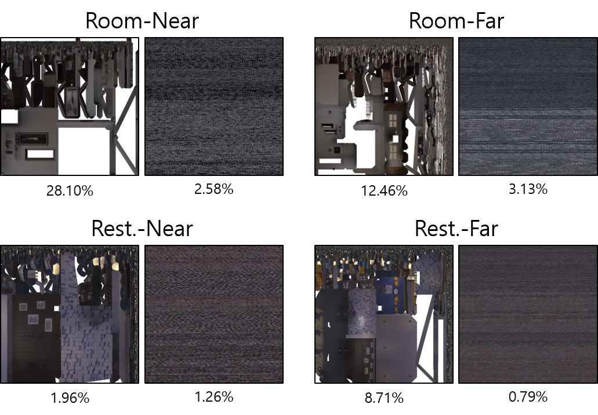

# Voxel-wise UV Parameterization and View-dependent Texture Synthesis for Immersive Rendering of TSDF Scene Model

We are constantly updating at this time to time.

## UV Map Lookup Table

Our initial version of the UV map lookup table (256 pairs of Marching Cube topology and UV Map) is presented below.

  

## Waste-rate of Texture Space

On average, 12.81% of texture space was not used for conventional UV texture maps, and 1.94% of space was not used for our texture maps.

  

## View-Dependent Texture Synthesis

Our view-dependent textures rendered both specular effects and texture details well.

  

